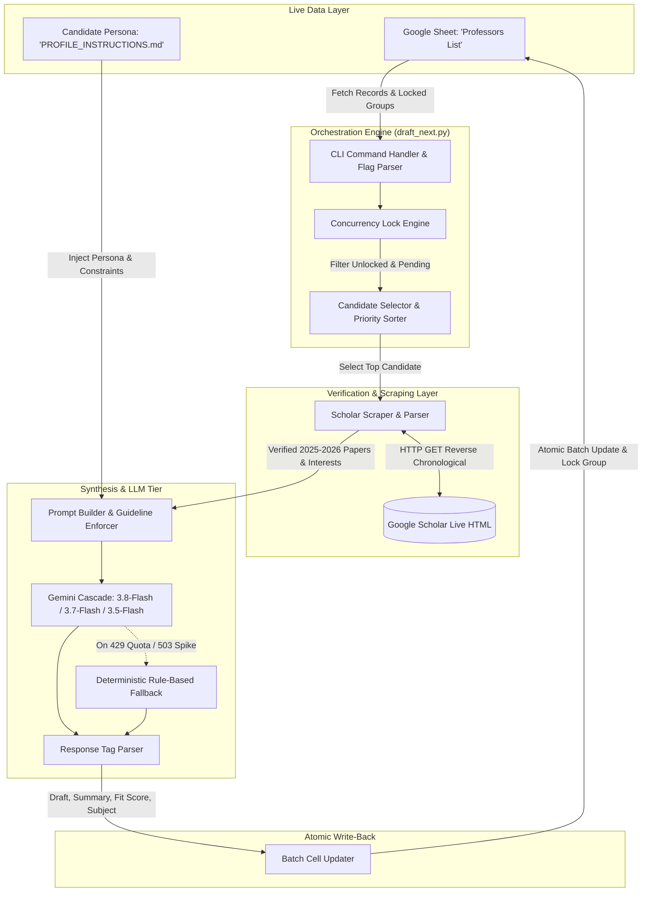

# Product Design Report (PDR)
## Project: Autonomous PhD Outreach & Research-Matching Agent (`ProfEmail`)

**Document Version:** 1.0.0  
**Date:** September 2026  
**Author:** Forhad Uddin Ahmed  
**Repository:** [FForhad/profemail](https://github.com/FForhad/profemail)  
**System Status:** Production / Active  

---

## 1. Executive Summary & Product Vision

### 1.1 Problem Statement
Prospective graduate school applicants face substantial inefficiencies and ethical challenges during the academic outreach process:
1. **Departmental Collision Risk**: Sending cold outreach emails simultaneously to multiple faculty members in the same academic department or laboratory violates academic etiquette and compromises applicant credibility.
2. **Hallucinated Citations & Generic Templates**: Typical AI tools often hallucinate non-existent paper titles, quote outdated research from a decade ago, or produce bloated, generic cover letters (>300 words) that professors routinely ignore.
3. **Synchronization Overhead**: Maintaining outreach state across multiple databases, trackers, and local files creates high cognitive overhead and data inconsistencies.

### 1.2 Product Vision
`ProfEmail` is an autonomous, single-command PhD outreach and research-matching assistant. It leverages a **live Google Sheet as its single source of truth**, enforces **departmental concurrency locks**, scrapes **verified reverse-chronological publications from Google Scholar (prioritizing 2025–2026)**, and synthesizes tailored, academically calibrated outreach drafts ($\le 150$ words) using a resilient **multi-tier Google Gemini LLM cascade**.

---

## 2. High-Level System Architecture

The system follows a modular pipeline architecture designed around live Google Sheet synchronization and resilient external service integrations.



---

## 3. Detailed Component Design

### 3.1 Live Database Layer (`gspread` Integration)
* **Zero Local Database Required**: Eliminates state drift by treating the Google Sheet as the live datastore.
* **Authentication**: Service Account authorization via `credentials.json` with Google Sheets and Google Drive API scopes.
* **Atomic Batch Updates**: Summaries, fit scores, subjects, drafts, and status transitions are written back in a single `worksheet.batch_update()` call, preventing partial writes or race conditions.

### 3.2 Concurrency & Department Lock Engine
* **Contact Group Locking**: Every target professor is assigned a `Contact Group (Lock)` (e.g. `Tohoku University-Graduate School of Information Sciences`, `UC Berkeley-EECS`).
* **Active Status Detection**: A group is strictly locked if any professor within it holds an active pipeline status:
  $$\text{Locked} \iff \text{Status} \in \{\text{Researching}, \text{Needs Review}, \text{Approved}, \text{Applied}\}$$
* **Mutual Exclusion**: When an outreach draft is generated, the candidate's status transitions to `Needs Review`, locking that Contact Group immediately for the remainder of the session and all future batches.
* **Partitioned Batch Scoping (`--start-row`)**: When processing distinct university blocks (e.g. starting a new batch from Row 178 or Row 235), the engine automatically scopes locks so previous completed runs do not inadvertently block newly targeted departments, while strictly maintaining intra-batch locks.

### 3.3 Google Scholar Verification & Scraping Engine
* **Anti-Hallucination Mandate**: The LLM is prohibited from citing any publication not extracted by the scraper or recorded in verified sheet metadata.
* **Reverse Chronological Enforcement**: Queries are automatically formatted with `&sortby=pubdate` to prioritize recent publications (2025 and 2026).
* **DOM Extraction**:
  * Publication title and year via `tr.gsc_a_tr` and `a.gsc_a_at`.
  * Co-authors and publication venue via `.gs_gray`.
  * Listed research topics via `#gsc_prf_int a`.
* **Resilient Fallback**: Falls back to user profile metadata and department sites if Scholar profile access is restricted.

### 3.4 Multi-Tier LLM Intelligence Engine
* **Primary Model Cascade**:
  1. `gemini-3.8-flash` (Primary fast reasoning model)
  2. `gemini-3.7-flash` (Automatic failover for 429 / 503 rate spikes)
  3. `gemini-3.5-flash` (Secondary failover)
  4. Deterministic Rule-Based Fallback (Offline fallback producing structured, domain-matched drafts based on verified regex-extracted papers)
* **Persona & Profile Grounding (`PROFILE_INSTRUCTIONS.md`)**:
  * Fixed positioning as an *"AI/ML Researcher and Software Engineer"*.
  * Strict prohibition against claiming current lecturer status (prior appointment concluded in May 2026).
  * Direct alignment with applicant's actual publication history (e.g. brain stroke prediction using ensemble techniques, financial time-series forecasting).
* **Strict Drafting Constraints**:
  * Maximum **150 words**.
  * Formal salutation with academic title and full name.
  * Inquiring about **Spring/Fall 2027** availability (specifically tailored for institutions in Japan and flexible worldwide programs).
  * Explicit mention that both **Resume and Academic Transcript** are attached for review.

---

## 4. Google Sheet Data Dictionary

| Column Name | Type | Role | Description |
|:---|:---:|:---:|:---|
| `Professor Name` | String | Required | Full name of the professor including title (e.g., `Prof. Takayuki Okatani`). |
| `University` | String | Required | Academic institution name. |
| `Country` | String | Optional | Target country (`Japan`, `USA`, `Germany`, etc.) used by CLI country filter. |
| `Department/Lab` | String | Required | Specific department, school, or research lab. |
| `Contact Group (Lock)` | String | Required | Canonical mutex key ensuring at most 1 active candidate per group. |
| `Priority` | String/Int | Optional | Prioritization ranking (`1` / `High`, `2` / `Medium`, `3` / `Low`). |
| `Google Scholar URL` | URL | Required | Google Scholar profile link used by live scraper. |
| `Pipeline Status` | Enum | State Machine | `Pending` $\rightarrow$ `Needs Review` $\rightarrow$ `Approved` $\rightarrow$ `Applied` / `Rejected` / `No Response`. |
| `LLM Research Summary` | Text | Auto-Generated | 2–4 sentences summarizing lab's current methodologies and recent work. |
| `LLM Fit Score (1-10)` | Integer | Auto-Generated | Calibrated research alignment score (1 = minimal overlap, 10 = exact direct match). |
| `Email Subject` | String | Auto-Generated | Standardized formal subject line (e.g. `Prospective PhD Applicant – Spring/Fall 2027 – Forhad Uddin Ahmed`). |
| `Email Draft` | Text | Auto-Generated | Synthesized email draft ($\le 150$ words) ready for human review. |

---

## 5. Command-Line Interface (CLI) Specification

```bash
python manage.py draft_next [OPTIONS]
```

### 5.1 CLI Options Reference

| Option | Type | Default | Description |
|:---|:---:|:---:|:---|
| `--limit N` | Integer | `1` | Number of eligible professors to process sequentially in the current batch. |
| `--start-row <INT>` / `--min-row <INT>` | Integer | `None` | Minimum sheet row number to start evaluating candidates from (e.g., `178`, `235`). |
| `--max-row <INT>` | Integer | `None` | Maximum sheet row number to evaluate up to. |
| `--country <COUNTRY>` | String | `None` | Case-insensitive filter matching candidate country (e.g., `Japan`, `USA`). |
| `--intake <STRING>` | String | Auto | Overrides default intake semester (e.g., `Spring/Fall 2027`, `Spring 2027`, `Fall 2026`). |
| `--ignore-preceding-locks` | Flag | Auto | Ignores locks from rows before `--start-row` (enabled by default when `--start-row` is provided). |
| `--enforce-all-locks` | Flag | `False` | Forces global lock validation across all sheet rows regardless of `--start-row`. |

### 5.2 Common Usage Patterns

```bash
# Process 2 professors from Japan starting at row 178
python manage.py draft_next --country Japan --start-row 178 --limit 2

# Process 10 professors from Japan with Spring/Fall 2027 intake
python manage.py draft_next --country Japan --start-row 178 --limit 10

# Process 10 professors from USA starting from row 235 with Spring/Fall 2027 intake
python manage.py draft_next --country USA --start-row 235 --intake "Spring/Fall 2027" --limit 10
```

---

## 6. Safety, Ethics, and Quality Assurance

1. **Human-in-the-Loop Safeguard**: The system **never sends emails automatically**. It only writes drafts to the Google Sheet and marks status as `Needs Review`, allowing the applicant to review and polish every email before dispatch.
2. **Academic Etiquette & Spam Prevention**: Strictly limits concurrent outreach to 1 professor per research group or department.
3. **Truthfulness and Calibration**: Fit scores are strictly calibrated based on real publication overlap; the prompt penalizes artificial score inflation.
4. **Credential Isolation**: All API keys and service account credentials reside in `.env` and `credentials.json`, which are strictly excluded from version control via `.gitignore`.

---

## 7. Future Roadmap & Technical Enhancements

- [ ] **Automated Gmail Draft Synchronization**: Directly generate Gmail drafts with attached `Resume.pdf` and `Transcript.pdf` via Google Workspace API.
- [ ] **Follow-up Response Tracker**: Parse inbound responses via IMAP/Gmail API and automatically transition sheet statuses from `Applied` to `Meeting Scheduled`, `No Response`, or `Rejected`.
- [ ] **Vector Embedding Matching**: Calculate dense cosine similarity between scraped publication abstracts and the candidate's research portfolio to further refine fit scores.
