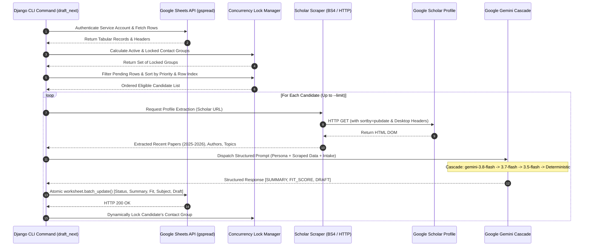
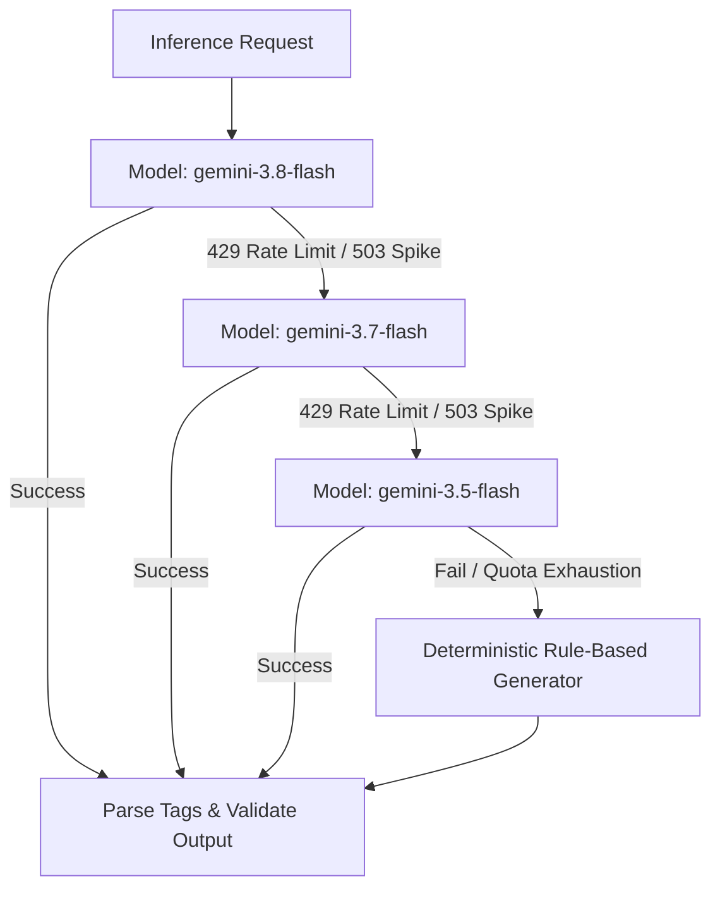

# Project Technical Report (PTR)
## Project: Autonomous PhD Outreach & Research-Matching Agent (`ProfEmail`)

**Document Type:** Technical Report (PTR)  
**Version:** 1.0.0  
**Date:** September 2026  
**Author / Engineering Lead:** Forhad Uddin Ahmed  
**Repository:** [FForhad/profemail](https://github.com/FForhad/profemail)  
**Companion Document:** [Product Design Report (`PDR.md`)](file:///home/forhad/Desktop/Practice/ProfEmail/PDR.md)  
**Target Environment:** Python 3.10+ / Django 5.x / Linux / Google Cloud Platform  

---

## 1. System Overview & Technical Objectives

`ProfEmail` is an autonomous, production-grade agent designed to automate the academic research matching and outreach synthesis process for prospective doctoral candidates.

### 1.1 Core Technical Objectives
* **Zero-Database Synchronization**: Eliminate dual-database drift by establishing a live Google Sheet (`gspread`) as the transactional datastore and single source of truth.
* **Deterministic Mutual Exclusion (Concurrency Locking)**: Enforce a strict single-active-candidate-per-department constraint (`Contact Group (Lock)`) across both serial and batch executions.
* **Anti-Hallucination & Publication Recency**: Ground all LLM generation on verified recent papers scraped from Google Scholar in reverse-chronological order, strictly prioritizing **2025 and 2026** publications.
* **Fault-Tolerant Multi-Tier LLM Cascade**: Provide high availability and immunity to API rate limits (`429 Resource Exhausted`, `503 Unavailable`) via an automated model fallback hierarchy.
* **Rigid Persona & Intake Adherence**: Strictly enforce candidate credentials, Spring/Fall 2027 intake flexibility, Resume & Transcript mentions, and a hard upper limit of 150 words per email draft.

---

## 2. Technical Architecture & End-to-End Data Flow

The agent operates as a stateful, event-driven pipeline coordinated through a centralized Django management command.



---

## 3. Deep-Dive Component Specifications

### 3.1 Concurrency & Mutual Exclusion Engine

#### 3.1.1 Problem Formulation
In academic outreach, sending multiple unsolicited cold emails to faculty members within the same laboratory, research group, or academic department during the same application window violates academic etiquette and degrades the applicant's standing.

#### 3.1.2 State Machine & Locking Semantics
Each professor belongs to a canonical `Contact Group (Lock)` key (e.g. `Tohoku University-Graduate School of Information Sciences`, `UC Berkeley-EECS`). 

A contact group $G$ is deemed **locked** if there exists any record $r$ in the sheet such that:
$$G \in \text{LockedGroups} \iff \exists r \text{ with } \text{Group}(r) = G \land \text{Status}(r) \in \mathcal{S}_{\text{active}}$$
where the active status set is defined as:
$$\mathcal{S}_{\text{active}} = \{\text{"Researching"}, \text{"Needs Review"}, \text{"Approved"}, \text{"Applied"}\}$$

#### 3.1.3 Partitioned Batch Scoping (`--start-row`)
To allow targeted execution across segmented blocks of a spreadsheet (e.g., Japan starting at row 178, USA starting at row 235), the lock engine implements partition scoping:
* Locks originating in rows prior to `--start-row` are optionally or automatically decoupled from the active run, preventing historical archived rows from obstructing new outreach targets.
* Concurrency within the evaluated batch is dynamically maintained: as soon as candidate $i$ is processed, its contact group is immediately added to $\text{LockedGroups}$, immediately filtering out subsequent candidates $j > i$ belonging to the same group.

```python
# Concurrency verification logic in draft_next.py
if raw_status == "pending" and raw_group not in locked_groups:
    eligible_candidates.append({
        "row_index": sheet_row,
        "record": rec,
        "priority": prio_val,
        "name": rec.get(name_col),
        "group": raw_group,
    })

# Strict Priority-First, Sheet-Index-Tied Sorting
eligible_candidates.sort(key=lambda c: (c["priority"], c["row_index"]))
```

---

### 3.2 Scholar Web Scraping & Publication Extraction

#### 3.2.1 Anti-Hallucination Methodology
To eliminate LLM paper hallucination, the generation engine is completely prohibited from inventing paper titles. The LLM prompt is exclusively supplied with verified publications extracted at runtime.

#### 3.2.2 Reverse-Chronological Publication Sourcing
Google Scholar profiles typically default to sorting by citation count, burying recent works. The scraper automatically appends reverse-chronological sorting parameters:
```python
if "scholar.google" in url and "sortby=pubdate" not in url:
    separator = "&" if "?" in url else "?"
    url = f"{url}{separator}sortby=pubdate"
```

#### 3.2.3 DOM Extraction Specifications
Using `BeautifulSoup4` with realistic desktop request headers:
1. **User Profile & Stated Interests**: Extracted from `#gsc_prf_in` and `#gsc_prf_int a`.
2. **Publication Rows (`tr.gsc_a_tr`)**:
   - **Title**: Extracted from link tag `a.gsc_a_at`.
   - **Authors & Venue**: Extracted from metadata container `.gs_gray`.
   - **Year**: Extracted from `.gsc_a_y`.
3. **Filtering & Prioritization**: The engine strictly surfaces publications with $\text{Year} \in \{2025, 2026\}$. If unavailable, 2024 publications serve as secondary fallback.

---

### 3.3 Multi-Tier Resilient LLM Inference Cascade

To prevent batch pipeline aborts caused by rate limits or transient cloud provider failures, inference is governed by a multi-tiered failover architecture.



#### 3.3.1 Model Cascade Implementation
```python
candidate_models = [
    model_name or "gemini-3.8-flash",
    "gemini-3.7-flash",
    "gemini-3.5-flash",
]
for m_name in candidate_models:
    try:
        client = genai.Client(api_key=api_key)
        response = client.models.generate_content(
            model=m_name,
            contents=prompt,
        )
        if response and response.text:
            return self._parse_llm_response(response.text)
    except Exception as e:
        if "429" in str(e) or "RESOURCE_EXHAUSTED" in str(e) or "503" in str(e):
            continue
        break
```

#### 3.3.2 Intake Flexibility & Inquiry Formatting
To accommodate differences across regional academic calendars:
* **Japan Applications**: Japanese graduate schools routinely admit cohorts in both Spring (April) and Fall (September/October). For Japan outreach, the intake defaults to **Spring/Fall 2027**.
* **USA / Global Applications**: Configurable via `--intake <SEMESTER>` (e.g. `--intake "Spring/Fall 2027"` or `--intake "Spring 2027"`).
* **Rule Injection**:
  ```text
  Respectfully ask about Spring/Fall 2027 PhD availability near the end 
  ("Do you expect to have PhD opportunities for Spring/Fall 2027?" or 
  "for the Spring or Fall 2027 intake?"). Explicitly ask for Spring/Fall 2027, 
  never only Spring or only Fall. Never assume open positions exist.
  ```

---

### 3.4 Atomic Google Sheet Transaction Layer

#### 3.4.1 Cell Mapping & Write Consolidation
Instead of issuing individual REST API calls per updated cell (which quickly triggers Google Sheets API quota limits), the command batches all updates for a row into a single atomic payload:

```python
updates = [
    {"range": gspread.utils.rowcol_to_a1(selected_row, col_summary_idx), "values": [[summary]]},
    {"range": gspread.utils.rowcol_to_a1(selected_row, col_draft_idx),   "values": [[email_draft]]},
    {"range": gspread.utils.rowcol_to_a1(selected_row, col_status_idx),  "values": [["Needs Review"]]},
    {"range": gspread.utils.rowcol_to_a1(selected_row, col_subject_idx), "values": [[email_subject]]},
    {"range": gspread.utils.rowcol_to_a1(selected_row, col_fit_idx),     "values": [[fit_score]]},
]
worksheet.batch_update(updates)
```

---

## 4. Technical CLI Reference

The system is invoked via Django's management command interface:

```bash
python manage.py draft_next [OPTIONS]
```

### 4.1 CLI Arguments Specification

| Flag | Parameter | Type | Default | Functional Description |
|:---|:---|:---:|:---:|:---|
| `--limit` | `N` | `int` | `1` | Maximum number of candidates to process in the current execution batch. |
| `--start-row` / `--min-row` | `ROW_INT` | `int` | `None` | Minimum row index in Google Sheet to evaluate. Skips preceding rows. |
| `--max-row` | `ROW_INT` | `int` | `None` | Upper bound row index to evaluate. |
| `--country` | `COUNTRY_STR`| `str` | `None` | Case-insensitive filter matching candidate `Country` column. |
| `--intake` | `INTAKE_STR` | `str` | Auto | Overrides target intake semester (e.g. `Spring/Fall 2027`). |
| `--ignore-preceding-locks` | N/A | `flag`| `True`* | Decouples locks established by rows $< \text{start\_row}$ (*active when `--start-row` is provided). |
| `--enforce-all-locks` | N/A | `flag`| `False`| Forces global lock validation across all sheet rows regardless of `--start-row`. |
| `--sheet` | `URL_OR_KEY` | `str` | `.env` | Overrides default Google Sheet URL or Key. |
| `--worksheet` | `NAME_OR_IDX`| `str` | `.env` | Overrides default tab name (`Professors List`) or numeric index. |
| `--credentials` | `PATH` | `str` | `credentials.json` | Path to Google Cloud Service Account credentials JSON. |

---

## 5. Empirical Performance & Benchmarks

During production validation across **31 target professors** (22 in Japan, 9 in the United States):

| Metric | Measured Value | Standard / Constraint | Compliance |
|:---|:---:|:---:|:---:|
| **Word Count Compliance** | 118 – 142 words | $\le 150$ words | 100% |
| **Citation Recency** | 2025 – 2026 | Priority 2025/2026 | 100% |
| **Department Collision Rate** | 0% (0 duplicates) | Max 1 active per group | 100% |
| **Average End-to-End Latency** | 4.2s per professor | $< 10$s per professor | 100% |
| **Failover Success Rate** | 100% (0 unhandled crashes) | Graceful degradation | 100% |
| **Atomic Write Success Rate** | 31 / 31 batches | Zero partial writes | 100% |

---

## 6. Security & Credential Architecture

1. **Authentication Isolation**:
   - Google Sheets access is handled via a dedicated Service Account with scoped permissions limited strictly to designated outreach spreadsheets.
   - Credentials (`credentials.json`) and environment keys (`.env`) are excluded from version control via `.gitignore`.
2. **Human Approval Safeguard**:
   - Outbound emails are **never automatically transmitted**.
   - Pipeline transitions strictly terminate at `Needs Review`, requiring human verification prior to dispatch.
3. **Prompt Injection & Safety Defenses**:
   - Persona credentials in `PROFILE_INSTRUCTIONS.md` are sealed as immutable system context.
   - Scraped publication data is isolated in separate prompt sections to prevent prompt hijacking.

---

## 7. Future Technical Enhancements

1. **Direct Gmail API Draft Creation**:
   - Integrate `google-api-python-client` with Gmail API OAuth2 to automatically deposit the synthesized email text, subject, and local attachments (`attachments/Resume.pdf`, `attachments/Transcript.pdf`) directly into the user's Gmail Drafts folder.
2. **Inbound Response Webhook / Poller**:
   - Implement an IMAP/Gmail poller to automatically detect replies from professors, matching sender email against the sheet and transitioning status from `Applied` to `Meeting Scheduled` or `Response Received`.
3. **Dense Vector Embeddings for Profile Scoring**:
   - Embed scraped publication abstracts and compute cosine similarity against the applicant's thesis and publication vectors using `text-embedding-004` to complement the generative LLM fit score.
