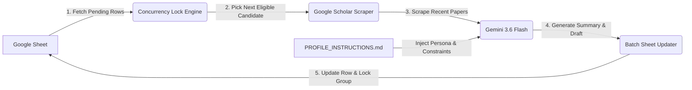

# PhD Outreach Agent (`ProfEmail`)

An autonomous, single-command PhD outreach assistant powered by **Django**, **Google Sheets (`gspread`)**, and **Google Gemini (`gemini-3.6-flash`)**. 

The system treats a Google Sheet as its single source of truth—automatically selecting candidate professors, enforcing departmental concurrency locks, scraping their real publications from Google Scholar, synthesizing personalized cold emails under strict academic guidelines, and writing the drafts back to the spreadsheet.

---

## 🌟 Key Features

* **Google Sheet as the Database**: Zero complex local database syncs. Your Google Sheet is the direct, live database.
* **Concurrency & Group Locking**: Automatically groups rows by `Contact Group (Lock)` (e.g., Department or Lab). If a professor in a group is active (`Researching`, `Needs Review`, `Approved`, or `Applied`), the entire group is locked to prevent reaching out to multiple professors in the same department simultaneously.
* **Live Scholar Scraping**: Scrapes target professors' Google Scholar profiles for real, verified publications (titles, years, co-authors, and themes). **No hallucinated paper titles.**
* **Strict Candidate Persona Enforcement**: Reads from [`PROFILE_INSTRUCTIONS.md`](PROFILE_INSTRUCTIONS.md) to strictly enforce accurate positioning (e.g., *AI/ML Researcher & Software Engineer*, never claiming active teaching positions that have concluded), genuine research alignment, and a strict **$\le 150$ word limit**.
* **Batch Execution**: Supports processing single or multiple professors sequentially (`--limit N`) while updating contact group locks on the fly.
* **Atomic Batch Updates**: Updates `Pipeline Status` (to `Needs Review`), `LLM Research Summary`, `LLM Fit Score (1-10)`, `Email Subject`, and `Email Draft` in a single API roundtrip.

---

## 📋 Pipeline Architecture



---

## 🚀 Getting Started

### 1. Clone the Repository
```bash
git clone https://github.com/FForhad/profemail.git
cd profemail
```

### 2. Create Virtual Environment & Install Dependencies
```bash
python3 -m venv .venv
source .venv/bin/activate
pip install -r requirements.txt
```

### 3. Setup Google Cloud Service Account
1. Create a Google Cloud Project and enable the **Google Sheets API**.
2. Create a Service Account and download the JSON key as `credentials.json` in the project root.
3. Share your Google Sheet with the Service Account email (with **Editor** permissions).

### 4. Configure Environment Variables
Copy `.env.example` to `.env` and fill in your details:
```bash
cp .env.example .env
```

```env
# Google Sheets
GOOGLE_SHEET_URL=https://docs.google.com/spreadsheets/d/YOUR_SHEET_ID/edit
GOOGLE_SHEET_NAME=Professors List
GOOGLE_APPLICATION_CREDENTIALS=credentials.json

# Google Gemini API
GEMINI_API_KEY=your_gemini_api_key
GEMINI_MODEL=gemini-3.6-flash
```

---

## ⚙️ Usage

Run the management command to process candidate professors:

### Process the Next Eligible Professor
```bash
python manage.py draft_next
```

### Process the Next $N$ Eligible Professors (Batch Mode)
```bash
python manage.py draft_next --limit 3
```

### Command Options
| Option | Description | Default |
| :--- | :--- | :--- |
| `--limit` | Number of professors to process in sequence | `1` |
| `--sheet` | Override sheet URL or ID from `.env` | Env value |
| `--worksheet` | Worksheet name or 0-indexed tab number | `Professors List` |
| `--credentials` | Path to service account JSON credentials | `credentials.json` |

---

## 📑 File Structure

```
profemail/
├── core/
│   └── management/
│       └── commands/
│           └── draft_next.py         # Main agent command (Fetch -> Lock -> Scrape -> LLM -> Update)
├── outreach_system/                  # Django project configuration
├── attachments/                      # Directory for academic CV & transcripts
├── PROFILE_INSTRUCTIONS.md           # Persistent candidate profile, research expertise & rules
├── WORKFLOW_INSTRUCTIONS.md          # 7-step standard operating procedure for AI pair programmers
├── .env.example                      # Template environment variables
├── requirements.txt                  # Python dependencies
├── LICENSE                           # MIT License
└── README.md                         # Project documentation
```

---

## 📄 License

Distributed under the MIT License. See [`LICENSE`](LICENSE) for more information.
