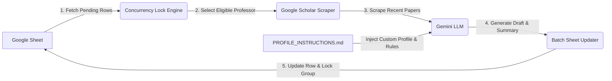

# PhD Outreach Agent (`ProfEmail`)

An autonomous, single-command PhD outreach and research-matching assistant powered by **Python**, **Django**, **Google Sheets (`gspread`)**, and **Google Gemini LLM**.

The system uses a Google Sheet as its single source of truth—automatically identifying candidate professors, enforcing departmental concurrency locks, scraping their real, verified publications from Google Scholar, synthesizing personalized cold emails under strict academic guidelines based on your custom profile, and writing the drafts and research summaries directly back to your spreadsheet.

---

## 🌟 Key Features

* **📊 Google Sheet as Live Database**: No local database management or complex synchronization required. Your Google Sheet acts as the direct live database.
* **🔒 Concurrency & Department Locking**: Uses `Contact Group (Lock)` (e.g., Department or Lab name) to prevent emailing multiple professors in the same department or research group at the same time.
* **🔍 Live Google Scholar Scraping**: Scrapes target professors' Google Scholar profiles for verified, recent publications (prioritizing 2025 and 2026). **Zero hallucinated paper titles.**
* **👤 Fully Customizable Persona (`PROFILE_INSTRUCTIONS.md`)**: Automatically injects your background, research interests, publications, degree details, and target intake into the LLM prompt.
* **✍️ Strict Academic Constraints**: Enforces formal academic tone, concise drafts ($\le 150$ words), mentions of attached Resume and Transcript, calibrated fit scores (1–10), and verified paper references.
* **⚡ Batch Processing**: Draft outreach emails one by one (`draft_next`) or in batches (`--limit N`) while updating group locks dynamically.
* **🔄 Atomic Sheet Updates**: Writes back `Pipeline Status` (to `Needs Review`), `LLM Research Summary`, `LLM Fit Score (1-10)`, `Email Subject`, and `Email Draft` in a single API call.

---

## 📋 Pipeline Workflow



---

## 🚀 Step-by-Step Setup Guide

Follow these steps to set up and run the project with your own profile and Google Sheet.

### 1. Clone the Repository

```bash
git clone https://github.com/FForhad/profemail.git
cd profemail
```

---

### 2. Set Up Virtual Environment & Dependencies

Create a Python virtual environment (Python 3.10+ recommended) and install dependencies:

```bash
# Create virtual environment
python3 -m venv .venv

# Activate virtual environment
# On Linux/macOS:
source .venv/bin/activate
# On Windows (Command Prompt / PowerShell):
# .venv\Scripts\activate

# Install required packages
pip install -r requirements.txt
```

---

### 3. Customize Your Profile (`PROFILE_INSTRUCTIONS.md`)

The LLM uses [`PROFILE_INSTRUCTIONS.md`](PROFILE_INSTRUCTIONS.md) as persistent context to personalize every email draft and calculate accurate research-fit scores.

Open [`PROFILE_INSTRUCTIONS.md`](PROFILE_INSTRUCTIONS.md) and update it with your own information:
* **Section 1 (Current Profile)**: Your full name, current professional positioning (e.g., *AI/ML Researcher & Software Engineer*), and target academic goal.
* **Section 2 (Education)**: Your university, degree, CGPA, graduation dates, and thesis topic.
* **Section 3 (Research Interests)**: Your specific research domains (e.g., Computer Vision, NLP, Robotics, Systems, etc.).
* **Section 4 (Publications)**: Your published papers, journals, conferences, and DOIs (if any).
* **Section 5–7 (Experience & Skills)**: Your industry experience, teaching roles, technical stack, and competitive programming achievements.
* **Section 11–13 (Positioning & Target Intake)**: Your preferred introduction template and target semester (e.g., *Fall 2026* or *Spring 2027*).

> [!TIP]
> Keep your information truthful and specific in `PROFILE_INSTRUCTIONS.md`. The LLM strictly adheres to the facts listed in this document to prevent exaggerations or unsupported claims.

---

### 4. Set Up Google Cloud & Download `credentials.json`

The agent uses a Google Cloud Service Account to read and write directly to your Google Sheet.

1. **Go to Google Cloud Console**: Navigate to [console.cloud.google.com](https://console.cloud.google.com/) and sign in with your Google account.
2. **Create a Project**: Click the project dropdown at the top and select **New Project** (e.g., name it `ProfEmail-Outreach`).
3. **Enable Google Sheets API**:
   * In the navigation menu, go to **APIs & Services > Library**.
   * Search for **Google Sheets API**.
   * Click on it and press the blue **ENABLE** button.
4. **Create a Service Account**:
   * Go to **APIs & Services > Credentials**.
   * Click **+ CREATE CREDENTIALS** at the top and choose **Service Account**.
   * Enter a service account name (e.g., `sheet-agent`) and click **Create and Continue**, then click **Done**.
5. **Download the Service Account JSON Key**:
   * On the Credentials page, click on your newly created Service Account under the *Service Accounts* list.
   * Go to the **Keys** tab.
   * Click **Add Key > Create new key**.
   * Select **JSON** format and click **Create**.
   * A `.json` file will download to your computer.
6. **Place in Project Root**:
   * Rename the downloaded file to `credentials.json` and move it into the root directory of this repository (`profemail/credentials.json`).
7. **Copy Service Account Email**:
   * Note down the Service Account email address (e.g., `sheet-agent@your-project-id.iam.gserviceaccount.com`). You will need this in Step 5.

---

### 5. Prepare and Share Your Google Sheet

1. **Create or Open Your Google Sheet**:
   * Create a new spreadsheet in Google Drive (or use an existing one).
   * Name the tab/worksheet (e.g., `Sheet1` or `Professors List`).
2. **Share Sheet with Service Account**:
   * Click the **Share** button in the top-right corner of your Google Sheet.
   * Paste the **Service Account Email** copied in Step 4.
   * Assign the role **Editor** and uncheck *Notify people*, then click **Share**.
3. **Ensure Sheet Headers are Present**:
   Make sure the first row (headers) contains the following columns:

| Column Header | Required / Optional | Purpose |
| :--- | :--- | :--- |
| `Professor Name` | **Required** | Full name of the professor |
| `University` | Optional | Name of the institution |
| `Department/Lab` | Optional | Department or research lab name |
| `Contact Group (Lock)` | **Required** | Group identifier (e.g., `MIT-EECS`) to prevent simultaneous outreach |
| `Pipeline Status` | **Required** | Set to `Pending` for new candidates. The agent updates this to `Needs Review`. |
| `Google Scholar URL` | **Required** | Link to the professor's Google Scholar profile page |
| `Priority` | Optional | Priority integer (e.g., `1` for High, `2` for Medium, `3` for Low) |
| `Country` | Optional | Country of institution (e.g., `USA`, `Germany`) |
| `LLM Research Summary` | **Auto-filled** | Summary of professor's recent research generated by LLM |
| `LLM Fit Score (1-10)` | **Auto-filled** | Calibrated alignment score (1–10) evaluated by LLM |
| `Email Subject` | **Auto-filled** | Personalized email subject line |
| `Email Draft` | **Auto-filled** | Generated outreach email draft ($\le 150$ words) |

---

### 6. Configure Environment Variables (`.env`)

1. Copy the sample environment file:
   ```bash
   cp .env.example .env
   ```
2. Open `.env` and configure your settings:

```env
# Google Sheets Configuration
GOOGLE_SHEET_URL=https://docs.google.com/spreadsheets/d/YOUR_SPREADSHEET_ID/edit
GOOGLE_SHEET_NAME=Sheet1
GOOGLE_APPLICATION_CREDENTIALS=credentials.json

# Google Gemini LLM Configuration
# Get your API key from https://aistudio.google.com/
GEMINI_API_KEY=your_gemini_api_key_here
GEMINI_MODEL=gemini-2.5-flash
```

> [!NOTE]
> You can get a free Gemini API key from [Google AI Studio](https://aistudio.google.com/).

---

## ⚙️ Usage & Execution

Run the Django management command to fetch eligible professors, scrape publications, generate drafts, and update the sheet:

### 1. Process the Next Eligible Professor
```bash
python manage.py draft_next
```

### 2. Process Multiple Professors in Batch
```bash
# Process the next 5 eligible professors sequentially
python manage.py draft_next --limit 5
```

### 3. Filter by Country
```bash
# Process eligible professors in the USA only
python manage.py draft_next --country USA --limit 3
```

### 4. Limit by Maximum Sheet Row Number
```bash
# Only process candidate rows up to row 50
python manage.py draft_next --max-row 50 --limit 5
```

### 5. Command-Line Options Reference

| Option | Description | Default |
| :--- | :--- | :--- |
| `--limit N` | Number of eligible professors to process in sequence | `1` |
| `--sheet <URL_OR_ID>` | Override Google Sheet URL or ID from `.env` | Env value |
| `--worksheet <NAME>` | Worksheet/tab name or 0-indexed tab number | Env value / 1st tab |
| `--credentials <PATH>`| Custom path to service account JSON key | `credentials.json` |
| `--country <COUNTRY>` | Filter professors by country (e.g., `USA`, `Canada`) | None |
| `--max-row <INT>` | Maximum row number in sheet to evaluate | None |

---

## 🔒 Concurrency & Group Locking Explained

To maintain academic etiquette and prevent awkward situations where two professors in the same department receive simultaneous cold emails from the same applicant, the agent enforces concurrency locking:

1. Every professor belongs to a **`Contact Group (Lock)`** (e.g., `Stanford-CS`, `CMU-LTI`, `Oxford-Robotics`).
2. If any professor in a group has an active status (`Researching`, `Needs Review`, `Approved`, or `Applied`), the **entire group is locked**.
3. The agent skips locked groups and picks the next available candidate with `Pipeline Status = Pending` whose group is unlocked.
4. Once you decide to archive or reject an outreach (e.g. status changed to `Rejected` or `No Response`), the group automatically unlocks for other professors in that department.

---

## 📂 Project Structure

```
profemail/
├── core/
│   └── management/
│       └── commands/
│           └── draft_next.py         # Main agent logic (Fetch -> Lock -> Scrape -> LLM -> Writeback)
├── outreach_system/                  # Django project configuration & settings
│   ├── settings.py                   # Environment variable loading & app settings
│   ├── urls.py
│   └── wsgi.py
├── attachments/                      # Folder to store your CV, Resume, and Transcripts
├── PROFILE_INSTRUCTIONS.md           # Persistent candidate profile, research expertise & rules
├── WORKFLOW_INSTRUCTIONS.md          # Standard operating procedure & development workflow
├── .env.example                      # Template environment variables
├── requirements.txt                  # Python dependencies
├── credentials.json                  # Google Cloud Service Account JSON key (gitignored)
├── LICENSE                           # MIT License
└── README.md                         # Project documentation
```

---

## 🛠️ Troubleshooting & FAQ

<details>
<summary><b>1. Error: Google credentials file not found</b></summary>

* Ensure `credentials.json` is located in the root project folder (or verify the path specified in `.env` under `GOOGLE_APPLICATION_CREDENTIALS`).
* Ensure the filename matches exactly: `credentials.json`.
</details>

<details>
<summary><b>2. Error: Google Sheets API is disabled in project</b></summary>

* You need to enable the Google Sheets API in your Google Cloud Console.
* Visit: [Google Sheets API Console](https://console.cloud.google.com/apis/library/sheets.googleapis.com) and click **Enable**.
</details>

<details>
<summary><b>3. Error: gspread.exceptions.SpreadsheetNotFound / Permission Denied</b></summary>

* Make sure you shared your Google Sheet with the **Service Account Email** (found in `credentials.json` as `client_email`) and gave it **Editor** permissions.
* Verify `GOOGLE_SHEET_URL` in `.env` matches the full URL of your Google Sheet.
</details>

<details>
<summary><b>4. Output says: "No eligible professors found"</b></summary>

* Verify that your sheet has rows with `Pipeline Status` set to `Pending`.
* Check if the `Contact Group (Lock)` for those professors is already locked by another row with status `Needs Review`, `Approved`, or `Applied`.
</details>

<details>
<summary><b>5. How do I change the LLM model?</b></summary>

* In your `.env` file, set `GEMINI_MODEL=gemini-2.5-flash` or `GEMINI_MODEL=gemini-1.5-pro`.
</details>

---

## 📄 License

Distributed under the MIT License. See [`LICENSE`](LICENSE) for more details.
